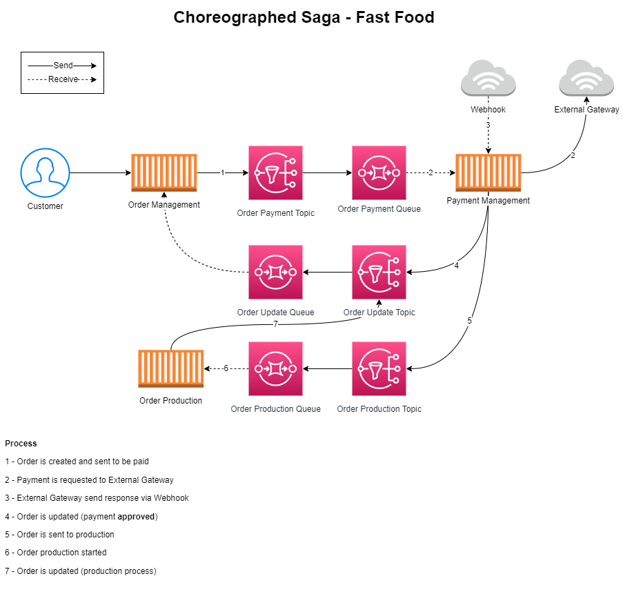
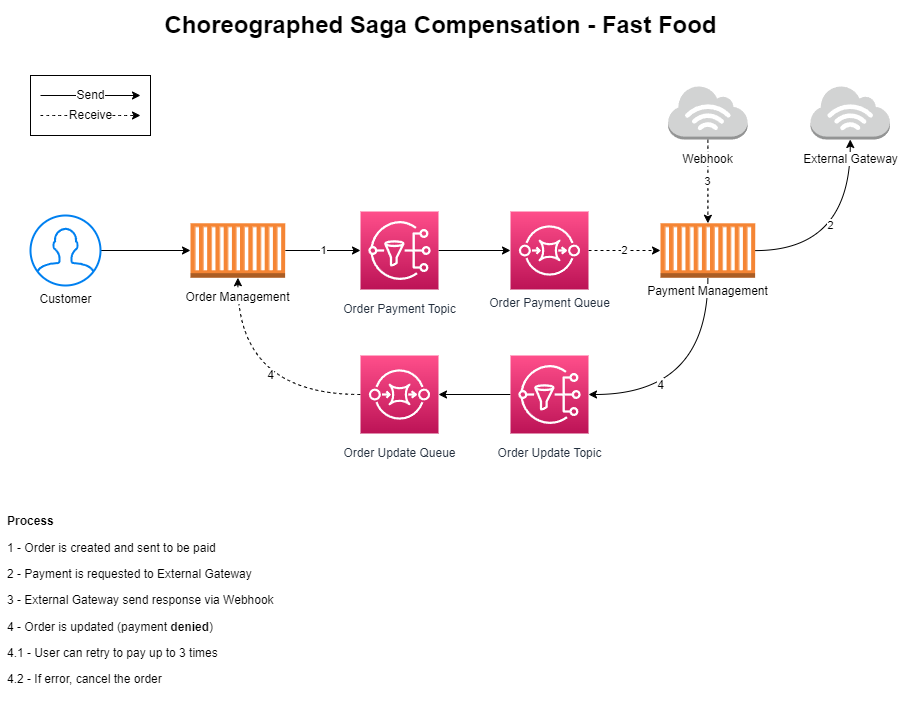
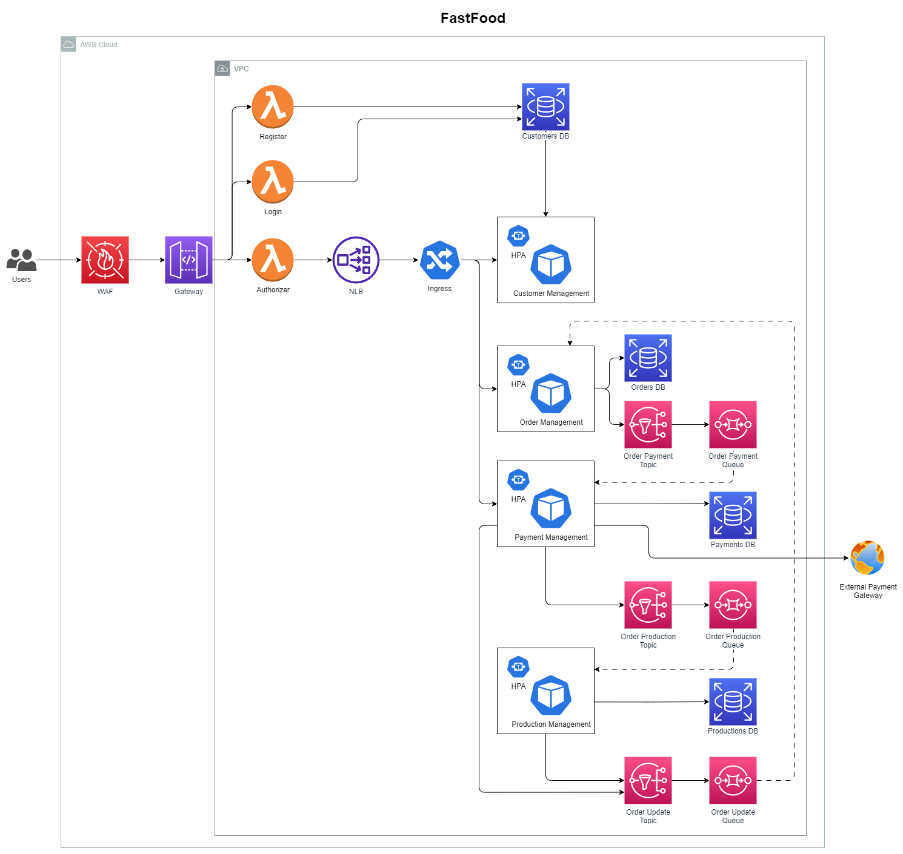

# Fast Food Org

### Microservices Diagram
Visit this [link](https://miro.com/app/board/uXjVKVqKe0Y=/?share_link_id=873646210769) to visualize the diagram.

### Download Postman Collection

Click [here](https://github.com/jfelipearaujo-fastfood/.github/blob/main/profile/postman_collection.json) to download the Postman Collection.

## Deployment Order

- EKS Cluster IaC
- Databases IaC
- Queues & Topics IaC
- Lambda Migrator
- Microservices
- Lambda Register
- Lambda Authorizer
- Lambda Login
- API Gateway

## RIPD Report

The RIPD report can be found [here](./ripd/RIPD.pdf).

## OWASP Zap Reports

Bellow you can find the OWASP Zap reports for the project.

Since none of the reports returned high severity issues, no fixes were applied to the project.

### List products

To view the PDF report, click [here](./owasp/2024-08-05-ZAP-Report-Listar%20Cardapio.pdf).

| Risk Level     | Number of Alerts |
| -------------- | ---------------- |
| High           | 0                |
| Medium         | 0                |
| Low            | 2                |
| Information    | 1                |
| False Positive | 0                |

### Checkout 

To view the PDF report, click [here](./owasp/2024-08-05-ZAP-Report-Realizacao%20Pedido.pdf).

| Risk Level     | Number of Alerts |
| -------------- | ---------------- |
| High           | 0                |
| Medium         | 0                |
| Low            | 1                |
| Information    | 0                |
| False Positive | 0                |

### Payment generation

To view the PDF report, click [here](./owasp/2024-08-05-ZAP-Report-Geracao%20Pagamento.pdf).

| Risk Level     | Number of Alerts |
| -------------- | ---------------- |
| High           | 0                |
| Medium         | 0                |
| Low            | 1                |
| Information    | 0                |
| False Positive | 0                |

### Payment confirmation

To view the PDF report, click [here](./owasp/2024-08-05-ZAP-Report-Confirmacao%20Pagamento%20via%20Webhook.pdf).

| Risk Level     | Number of Alerts |
| -------------- | ---------------- |
| High           | 0                |
| Medium         | 0                |
| Low            | 1                |
| Information    | 0                |
| False Positive | 0                |

## SAGA

The SAGA pattern chosen for the project is the Choreographed Saga Pattern. This pattern was chosen because it is a good fit for the use case of the application, which is a microservices architecture. Since the project is not so big or complex, the use case is simple enough to be implemented with this pattern.

Bellow is a diagram of the SAGA pattern when the order follows the "happy path":

But when the order follows the "unhappy path", like an invalid payment, the compensation flow is used to handle the exception:

## Architecture

The diagram below shows the architecture of the project:

## Infrastructure as a Code (IaC)
### [EKS Cluster IaC](https://github.com/jfelipearaujo-fastfood/eks-cluster-iac)

### [Databases IaC](https://github.com/jfelipearaujo-fastfood/database-iac)

### [Queues & Topics IaC](https://github.com/jfelipearaujo-fastfood/queues-topics-iac)

### [API Gateway](https://github.com/jfelipearaujo-fastfood/api-gateway)

## Lambdas
### [Lambda Authorizer](https://github.com/jfelipearaujo-fastfood/lambda-authorizer)

### [Lambda Login](https://github.com/jfelipearaujo-fastfood/lambda-login)

### [Lambda Register](https://github.com/jfelipearaujo-fastfood/lambda-register)

### [Lambda Migrator](https://github.com/jfelipearaujo-fastfood/lambda-migrator)

## Microservices

### [MS Product Catalog](https://github.com/jfelipearaujo-fastfood/ms-product-catalog)

### [MS Order Management](https://github.com/jfelipearaujo-fastfood/ms-order-management)

### [MS Payment Management](https://github.com/jfelipearaujo-fastfood/ms-payment-management)

### [MS Production Management](https://github.com/jfelipearaujo-fastfood/ms-production-management)

### [MS Customer Management](https://github.com/jfelipearaujo-fastfood/ms-customer-management)

